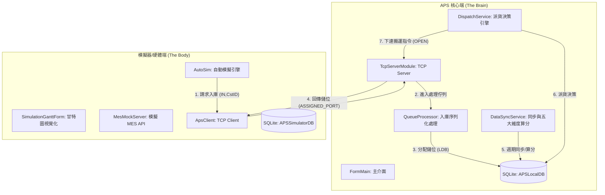

# AdvancedPlanningSystem (APS) 系統架構與開發維護指南 (v2.5)

## 1. 系統簡介
**自動化派貨決策系統 (APS)**。其核心目標是根據 Q-Time（時效）、交期、緊急度等權重，自動指揮物流系統將卡匣 (Cassette) 從貨架送往最適當的機台進行加工。

### 技術棧
*   **框架**：.NET Framework 4.5.2 (Windows Forms)
*   **資料庫**：SQLite (本地狀態維護)
*   **通訊**：自定義 TCP (硬體/模擬器通訊) + REST API (MES 資料同步)
*   **套件**：NPOI (Excel 處理)、log4net (日誌)、Newtonsoft.Json (資料解析)

---

## 2. 系統架構圖 (System Architecture)

---

## 3. 核心邏輯模組

### 3.1 入庫序列化機制 (Queue-based Stock-In)
*   **檔案**：`FormMain.cs` -> `ProcessStockInQueueAsync`
*   **原理**：為了防止大量卡匣同時入庫時產生「儲位碰撞 (Race Condition)」，所有 `IN` 指令會先進入 `ConcurrentQueue`。系統會以單執行緒依序取出，執行「查詢空位 -> 綁定 -> 回報」。
*   **開發者注意**：若要修改分配演算法（如：改為離下一站最近的儲位），應在此方法中修改。

### 3.2 派貨決策引擎 (Dispatching Engine)
*   **檔案**：`DispatchService.cs`
*   **決策維度**：Q-Time 風險、緊急度、工程件優先、交期、LeadTime。
*   **Pass99 邏輯**：當 `AppConfig.MesMockEnabled = true` 且站點未定義機台時，系統會自動給予 `Pass99` 目標，強制卡匣流動。
*   **生產模式安全**：若 `MesMockEnabled = false`，遇到未定義站點會立即彈出報警並將卡匣 `HOLD`。

### 3.3 資料同步與算分 (Sync & Scoring)
*   **檔案**：`DataSyncService.cs`
*   **機制**：
    *   **週期性**：由 `AppConfig.SyncIntervalSec` 控制。
    *   **事件驅動**：當收到硬體回報 `ENTER` (進入機台) 指令時，會觸發「即時同步」，加速將卡匣從 `Transit` (運輸中) 狀態移除。

---

## 4. 模擬器特色功能

### 4.1 自動模擬與甘特圖
*   **自動化流程**：模擬器支援從 Excel 匯入工單，自動執行「入庫 -> 等待派送 -> 搬運 -> 加工 -> 完工 -> 回存」的完整閉環。
*   **視覺化甘特圖**：
    *   **凍結標題列**：向右捲動時間軸時，左側 ID 始終固定。
    *   **交錯標籤**：時間軸文字上下交錯，防止重疊。
    *   **日誌解析**：採用白清單機制，僅解析合法卡匣 ID，過濾機台編號等雜訊。

---

## 5. 開發者維護指南

### 常見配置 (AppConfig.cs)
*   `SyncIntervalSec`：APS 同步頻率（建議 10-30 秒）。
*   `SimProcessMinSec / MaxSec`：模擬器製程隨機時間。
*   `ManualMode`：若開啟，自動計時器將暫停，需手動點擊按鈕觸發決策。

### 資料庫維護
*   **APSLocalDB.db**：若系統狀態錯亂，可刪除此檔重新啟動，系統會自動重建 Schema。
*   **外部對應**：`ExternalDB.db` 負責 Barcode 與 WorkNo 的轉換，實際上線時通常會改為對接廠內 Web Service。

---

## 6. 未來擴充建議
1.  **多 Client 支援**：目前 TCP Server 僅支援單一連線（假設為單一物流控制器），未來若有多台機器手臂，需修改 `TcpServerModule` 改為 `List<TcpClient>` 結構。
2.  **演算法調整**：目前的分數計算為線性加權，未來可引入動態權重或機器學習模型優化生產週期。
3.  **雲端同步**：`ApsCloudDbRepository` 已預留介面，可進一步實作將生產數據即時推播至雲端監控平台。
